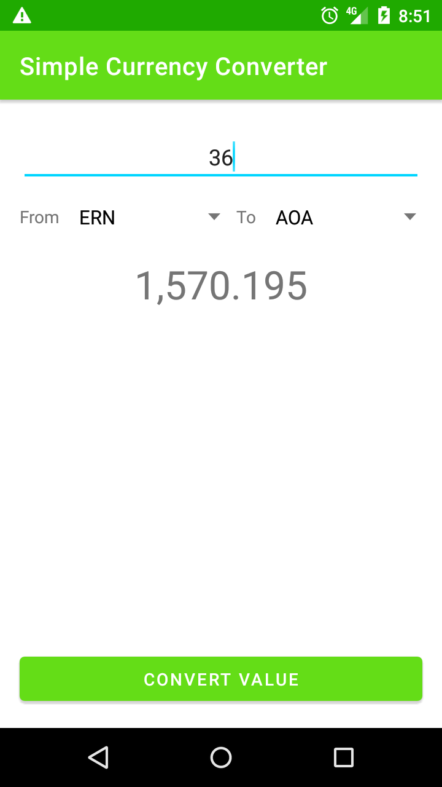
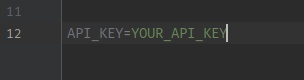

# Simple Currency Converter

:warning: This app uses [Currency Converter API](https://free.currencyconverterapi.com/) to convert the value. Then you will have to get a free api key [HERE](https://free.currencyconverterapi.com/free-api-key) and put it in your project's local.properties file.

